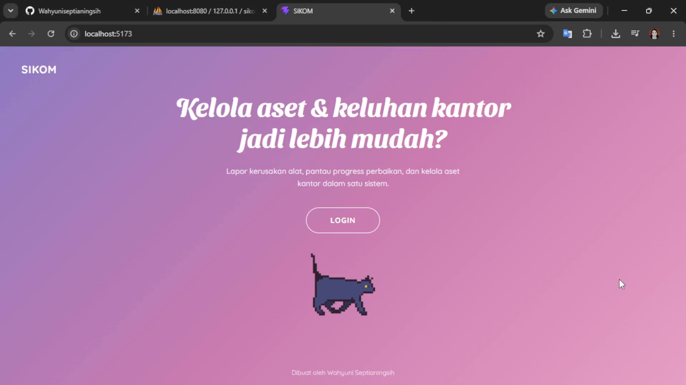
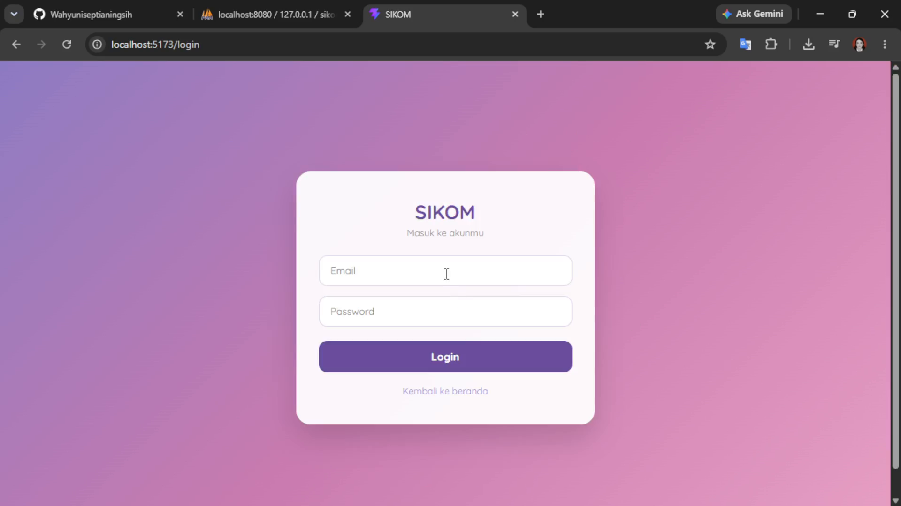
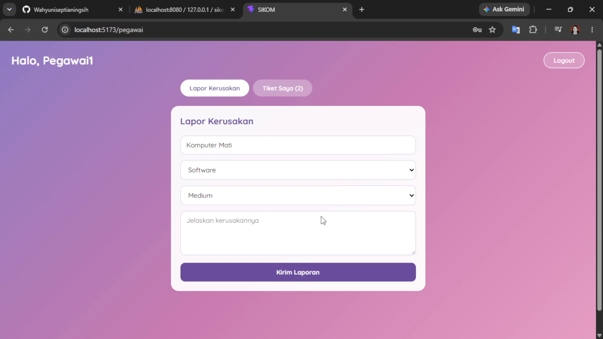
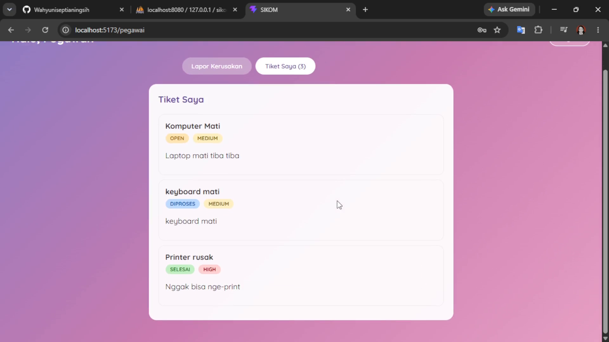
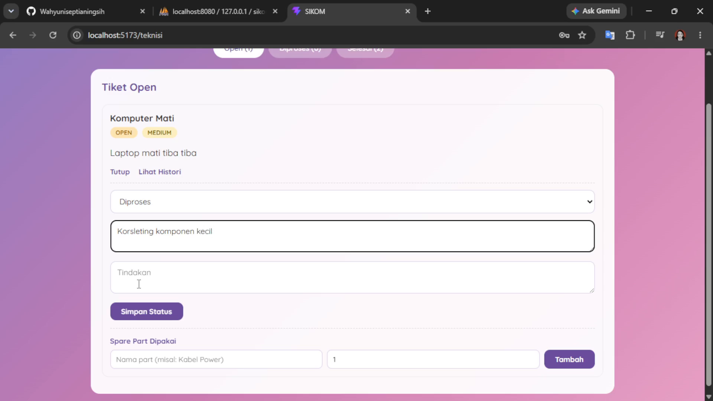
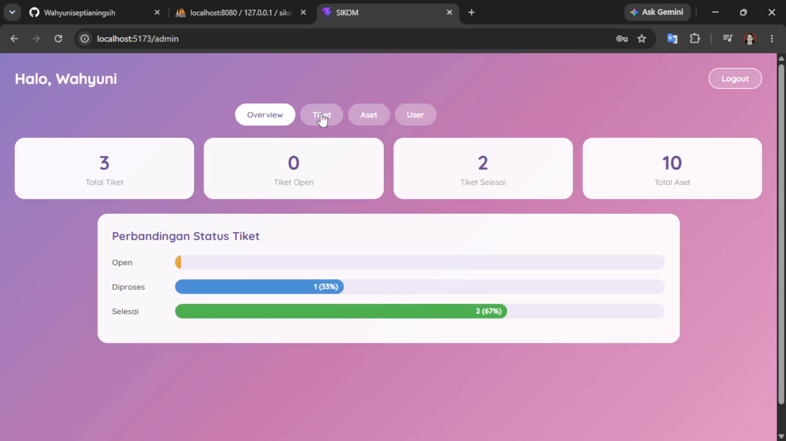
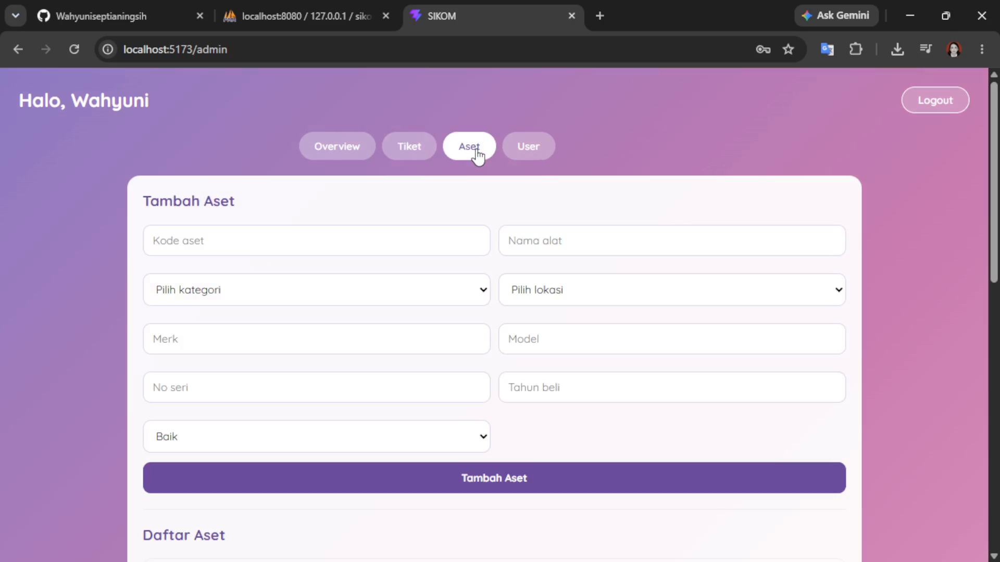

# SIKOM - Sistem Informasi Komplain & Manajemen Aset

SIKOM adalah aplikasi web buat mengelola keluhan/kerusakan alat kantor dan manajemen aset, dibuat sebagai bahan tugas akhir. Sistem ini menghubungkan tiga peran: pegawai yang melaporkan kerusakan, teknisi yang menangani laporan, dan admin yang mengawasi semuanya sekaligus mengelola data aset dan user.

Dibuat oleh **Wahyuni Septianingsih** (NIM 22SA11A047) - Informatika, Universitas Amikom Purwokerto.

## Kenapa Sistem Ini Dibuat

Di kantor atau instansi, laporan kerusakan alat sering masih dilakukan manual, misal lewat chat atau lisan, sehingga sulit dilacak progressnya dan gampang kelewat. SIKOM dibuat buat menjawab masalah ini dengan mendigitalisasi seluruh alur, dari pelaporan sampai penyelesaian, termasuk pencatatan histori penanganan dan spare part yang dipakai.

## Alur Penggunaan Sistem

Alur utamanya sederhana, terbagi jadi 3 tahap sesuai peran:

**1. Pegawai melaporkan kerusakan**
Pegawai login, mengisi form laporan (judul, kategori, prioritas, deskripsi kerusakan), lalu laporan otomatis masuk sebagai tiket berstatus "open". Pegawai bisa memantau semua tiket yang pernah dia buat beserta statusnya.

**2. Teknisi menangani tiket**
Semua tiket yang masuk bisa dilihat teknisi, dikelompokkan per status (Open, Diproses, Selesai) biar gampang diprioritaskan. Teknisi mengubah status tiket sambil mengisi diagnosis dan tindakan yang diambil, dan kalau perlu ganti spare part, itu juga dicatat. Setiap perubahan status otomatis tersimpan sebagai histori, jadi bisa dilihat siapa yang menangani dan kapan.

**3. Admin memantau dan mengelola**
Admin punya akses penuh: melihat ringkasan statistik (jumlah tiket per status, total aset), melihat semua tiket, mengelola data aset (tambah, edit, hapus), dan membuat akun baru untuk pegawai/teknisi/admin lain.

## Fitur per Halaman

### Beranda
Halaman awal berisi perkenalan singkat sistem dan tombol untuk masuk ke halaman login.

### Login
Semua user (pegawai, teknisi, admin) masuk lewat halaman yang sama. Setelah login, sistem otomatis mengarahkan ke dashboard sesuai peran masing-masing berdasarkan role yang tersimpan di akun.

### Dashboard Pegawai
Ada dua bagian: form "Lapor Kerusakan" untuk membuat laporan baru, dan "Tiket Saya" yang menampilkan daftar laporan yang pernah dibuat pegawai tersebut beserta status terkininya (badge warna: kuning untuk open, biru untuk diproses, hijau untuk selesai).

### Dashboard Teknisi
Tiket dikelompokkan jadi 3 tab berdasarkan status, biar teknisi bisa fokus ke yang belum selesai dulu. Di tiap tiket ada dua aksi: "Update Status" (mengubah status + mengisi diagnosis, tindakan, dan spare part yang dipakai) dan "Lihat Histori" (menampilkan seluruh riwayat penanganan tiket itu, termasuk siapa teknisi yang menangani tiap tahapnya).

### Dashboard Admin
Terbagi jadi 4 tab:
- **Overview** - ringkasan jumlah tiket (total, open, selesai) dan total aset, dilengkapi grafik perbandingan status tiket dalam bentuk persentase
- **Tiket** - daftar semua tiket yang masuk ke sistem
- **Aset** - form tambah aset baru sekaligus daftar aset yang bisa diedit atau dihapus
- **User** - form membuat akun baru (pegawai/teknisi/admin) dan daftar semua user yang terdaftar

## Tech Stack

**Frontend:** React (Vite), React Router, Axios
**Backend:** Node.js, Express
**Database:** MySQL (MariaDB)
**Autentikasi:** JWT (JSON Web Token) + bcrypt untuk hashing password

## Struktur Folder

    sikom-helpdesk/
    ├── backend/          -> API server (Express + MySQL)
    ├── frontend/         -> aplikasi React
    ├── database/         -> file struktur database (sql)
    └── screenshots/      -> gambar dokumentasi

## Role dan Hak Akses

Sistem punya 3 role dengan batasan akses yang berbeda:

| Aksi | Pegawai | Teknisi | Admin |
|---|---|---|---|
| Buat tiket | ya | tidak | tidak |
| Lihat semua tiket | - | ya | ya |
| Update status tiket | tidak | ya | ya |
| Hapus tiket | tidak | tidak | ya |
| Catat maintenance | tidak | ya | ya |
| Kelola aset (CRUD) | tidak | tambah/edit | penuh |
| Buat akun baru | tidak | tidak | ya |

Setiap request ke API divalidasi lewat token JWT dan role di dalamnya, jadi kalaupun seseorang mencoba akses endpoint yang bukan haknya, sistem akan menolak dengan status 403.

## Cara Menjalankan di Lokal

### 1. Siapkan database

Import file `database/sikom_schema.sql` ke MySQL/MariaDB (misal lewat phpMyAdmin) untuk membuat struktur tabel yang dibutuhkan.

### 2. Setup backend

Masuk ke folder backend dan install dependency:

    cd backend
    npm install

Buat file `.env` baru di dalam folder `backend`, isinya sesuaikan dengan koneksi database lokal kamu:

    DB_HOST=localhost
    DB_USER=root
    DB_PASSWORD=
    DB_NAME=sikom_db
    JWT_SECRET=isi_bebas_terserah
    PORT=5000

Jalankan servernya:

    node server.js

### 3. Setup frontend

Buka terminal baru, masuk ke folder frontend:

    cd frontend
    npm install
    npm run dev

Buka `http://localhost:5173` di browser.

### 4. Buat akun admin pertama

Karena pembuatan akun baru cuma bisa dilakukan oleh admin (lewat dashboard), admin pertama harus dibuat manual langsung lewat database. Insert satu baris ke tabel `users` dengan role admin (`role_id = 1`). Passwordnya perlu di-hash pakai bcrypt dulu sebelum dimasukkan ke database, tidak boleh disimpan sebagai teks biasa.

Setelah akun admin pertama itu ada, login pakai akun tersebut, lalu akun lainnya (teknisi, pegawai) bisa dibuat langsung lewat menu "User" di Dashboard Admin.

## Metodologi Pengembangan

Sistem ini dikembangkan mengikuti alur pengembangan web pada umumnya: mulai dari perancangan struktur database dan API, dilanjutkan pengujian tiap endpoint secara manual untuk memastikan role-based access berjalan benar, baru kemudian pembangunan antarmuka frontend untuk masing-masing peran.
